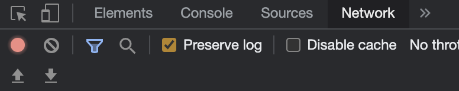
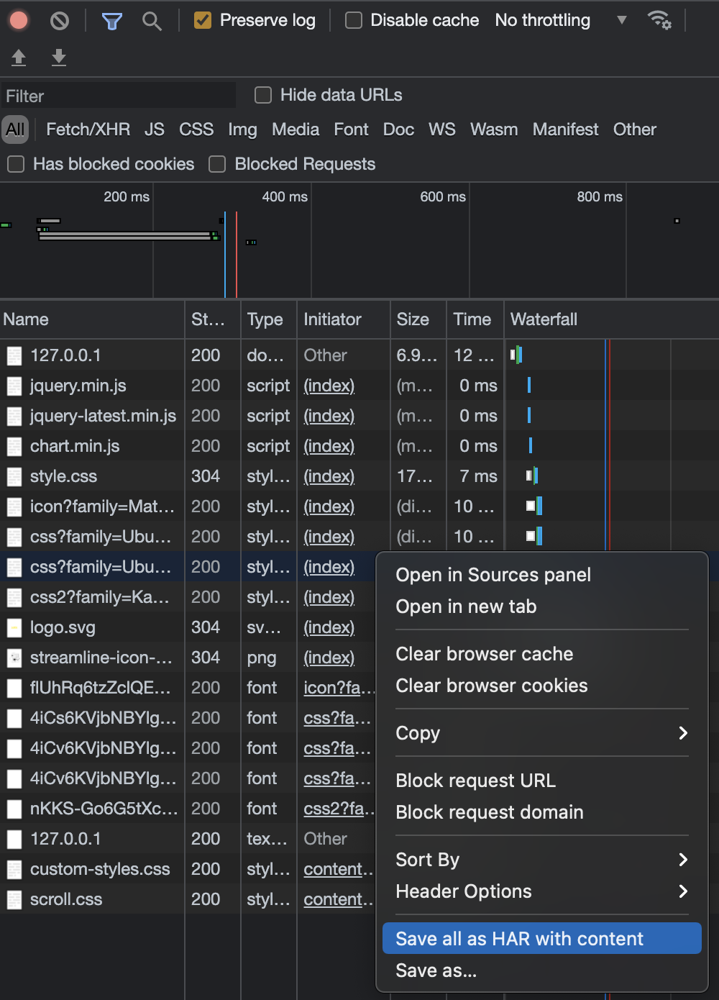

# Gatling
- open source testing software, can be used for load and performance testing of software
- the test software is configured with the browser instance of the software being tested - in this case it is the ITJobsWatch web app
- a test script is written and then executed

## Test Types
- Stress test: The maximum number of users a site can process at one time
- Load test: Technique that verifies whether the application can handle the expected load
- Performance test: Concerned with evaluating the overall system's performance and collecting metrics such as availability, response time, and stability.
- Penetration test: How the site deals with cyber attacks

## Recorder
- used to quickly generate scenarios - records a simple simulation used to mimic user behaviour
- after downloading the Gatling files, navigate to the `bin` folder and execute the `recorder.sh/recorder.bat` to set this location as the GATLING_HOME
- this then opens up a Java recorder page, where network, simulation and output settings can be applied
- when running tests in browser, the page must also be configured to use the Gatling recorder's proxy - this is done on the local machines network settings
- the port selected in the recorder config is the port that the browser must connect to so the recorder can capture the navigation, so after setting it in the recorder settings the browser must be configured to the same port
- the recorder runs the tests on the webpage within a proxy server
- once this recording is complete, a scala language script will be produced
- this script can then be configured to run for a set number of users for example
- https://www.youtube.com/watch?v=viNlhp_cJTk this link goes through the steps tp setup and run the recorder

## HAR files
- Instead of using the recorder, HAR (HTTP archive recording) files can also be used
- Navigate to the webpage (127.0.0.1:5000 on localhost for this example) and enable the developer tools within the browser
- In the network tab, clear the list and ensure the recording is enabled and the preserve logs box is checked

- Refresh the page, right click inside the list and select `save as HAR with context`

- This HAR file can then be used in the recorder to produce a scala script, by selecting the HAR option in the recorder, selecting the correct .har file and clicking start
- The script for this example is shown in this repo: `user-files/simulations/RecordedSimulation.scala`
- Method of generating an HAR file can capture a complete user journey on a site - logging in, browsing different pages etc
- The `.exec(http("request_0")` commands in the scala file can be renamed for ease of understanding what the script is doing - e.g. `.exec(http("LOAD_HOMEPAGE")` as this is what will show up in the test report
- When there are multiple steps to execute, the pause time between steps can also be altered

## Running Gatling tests
- In the same `bin` folder, execute the `gatling.sh/gatling.bat`, which will then return a list of simulation examples
- When the chosen simulation is complete, the console will display a link to an HTML display of the results
#### Load Test
- When running the above `gatling` file, select the configured simluation from the previous recording
- Enter a suitable `rundescription` - what the test is/number of users being tested etc
- Load tests can be set up to add certain numbers of users over certain periods of time, e.g. 10 users added over 5 seconds
- Users are added with the `setUp` command